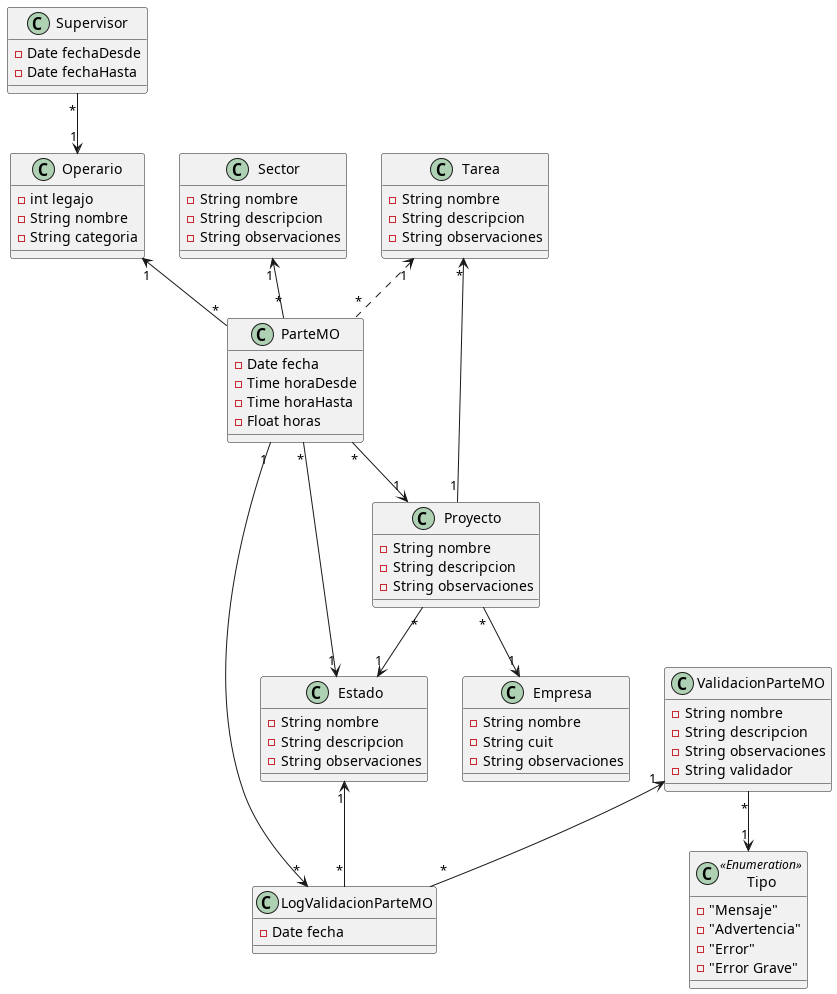

### Laboratorio de Programación y lenguajes
### Trabajo Práctico
# Partes de Mano de Obra

Para la instalación y configuración del entorno de desarrollo es necesario seguir el siguiente 
<a href="https://git.fi.mdn.unp.edu.ar/labprog/core/infraestructura-tps/-/blob/master/README.md" target="_blank">INSTRUCTIVO</a>

---

## Problema planteado
*Brifal S.A.* es una empresa de servicios de ingeniería y construcción y basa su operatoria fundamentalmente en los trabajos de ingeniería orientados al uso intensivo de mano de obra.
Es por ello que el control, supervisión y gestión sobre este recurso es importarte para la sana economía de Brifal.
Por ello el presente sistema brindará a Brifal de una herramienta que le permita comenzar a transitar el camino de la gestión de aplicación y uso de horas de mano de obra.

## Objetivo de la Solución
Brindar a Brifal de una herramienta de control y gestión de los partes de mano de obra con la consiguiente gestión del personal.
Como resultado adicional a la cuestión operativa de esta aplicación Brifal contará con un tablero de gestión que le permita tomar decisiones y realizar mejoras en la gestión de ejecución de los proyectos.
Para ello es importante entender que esta solución es sólo una parte que se concentra exclusivamente en la gestión de la mano de obra de los proyectos.
A futuro se deberá considerar complementar el presente desarrollo informático con el resto de las actividades de un proyecto, como lo son su presupuestación, alquiler de equipos y el consumo de materiales.

## La solución requiere

### Administración de Información del Ambiente para organizar la información de los partes

#### Administración de Clientes.
La Aplicación contará con una administración Básica de los clientes y toda la información que sea de utilidad para realizar a posteriori análisis de información de gestión por diferentes segmentos de información.

#### Administración de proyectos (OT).
La aplicación contará con una gestión básica de administración de proyectos (OT)(Unidad de Trabajo).
Básicamente con la idea que funcione ligado a la Orden de Compra del cliente y que el mismo permita realizar una administración básica de configuración para la gestión del personal involucrado.

Este módulo será de vital importancia a futuro si se integra con un módulo de presupuesto y de control y gestión de proyectos en forma integral.

La información de proyecto, deberá contener los datos de segmentación que permitan realizar gestión sobre el negocio tanto de aspectos económicos como de control.

Dentro de los mismos podemos destacar a nivel de cliente, toda la estructura de solicitud de un trabajo (Organigrama del cliente) y la información de gestión y comunicación para poder administrar a los proyectos vinculados con las actividades a desarrollar en el mismos y la lista de tareas para lograrlo.

#### Administración de personal.
La aplicación contará con una gestión de personal básica. Y una gestión de turnos
quincenales de asignación al personal.

### Administración y Gestión de Partes de Mano de Obra
#### Carga de Partes de Mano de obra.
La solución basará su operatoria principal en la carga de los partes de manos de obra que serán asignados a los proyectos y vinculados a un legajo de personal.
Este módulo de la aplicación deberá realizar el mayor esfuerzo de programación para garantizar la agilidad y seguridad de operación del mismo.

#### Control Horario del personal.
La aplicación permitirá realizar control y gestión de horas asignadas a los proyectos analizando la información cargada.
Permitiendo de esta forma garantizar la calidad de información que brindará la aplicación.
Para ello la solución basada en parámetros, la configuración y los proyectos, analizará los posibles problemas de carga de datos, brindando una herramienta para limpiar posibles incongruencias.
* Implementar gestión de turnos del personal donde se indique por quincena para cada operario el horario asignado (esto determina la cantidad de horas diarias).
* Indicar para cada turno la factibilidad de horas extra y en qué cantidad.

#### Auditoría sobre la gestión y modificación de los partes.
Para mejorar la gestión y los procedimientos sobre la gestión de partes la aplicación
registrará un histórico de cambios realizados sobre la información de los partes de mano
de obra, permitiendo de esta forma reconstruir y trazar la información operativa.

#### Control y corrección de partes por errores de carga.
La aplicación deberá soportar un mecanismo de ajuste de la información sin perder la cohesión. Para ello y soportado en la gestión de auditoría la aplicación garantizará modificaciones y correcciones consistentes en los partes de mano de obra.

#### Gestión de información.
La solución brindará un conjunto de reportes que permitirán la óptima gestión sobre la información producida.
* Cantidad de horas usadas por quincena por proyecto. Distribución de horas por proyecto. Discriminando horas extra y horas normales.
* Cantidad de horas usadas por quincena por Cliente. Distribución de horas por cliente. Discriminando horas extra y horas normales.
* Estadísticas de control de errores y avisos detectados, discriminando la cantidad de descartados y la cantidad de corregidos/aceptados.

## Criterio de satisfacción

### Ejemplo de uso y validaciones
La aplicación deberá garantizar la implementación de los casos de uso descriptos anteriormente.
La verificación de calidad se realizará utilizando las siguientes premisas para un conjunto de pruebas a realizar:
* Cargar múltiples proyectos para distintos clientes. Donde existan al menos dos tareas diferentes por cada uno.
Cargar al menos 2 proyectos diferentes para algunos clientes.
* Generar al menos 50 operarios distintos.
> Nota: Se recomienda que esta tarea se realice por simulación de datos y no por carga directa.

* Generar al menos 2 turnos diarios de 8 horas con capacidad de 50% de horas extras adicionales para uno de ellos. Generar al menos un calendario de 4 quincenas con rotación del personal.
> Nota: Se recomienda que esta tarea se realice por simulación de datos y no por carga directa.

* Diseñar pruebas de funcionalidad (una prueba por caso), donde se puedan verificar los siguientes controles:
  * Se ingresan al menos 10 operarios por lote de prueba de caso.
  * Se ingresa al menos un operario que está fuera de su turno.
  * Se ingresa al menos un operario que trabaje horas extras.
  * Se ingresa al menos un operario que supere la cantidad de horas del turno.

  > Nota: Se recomienda que parte de esta carga se realice por simulación de datos y no por carga directa. Se deben cargar muchos datos diarios.

* Comprobar que el proceso de verificación de partes genera las advertencias y errores producidos por cada prueba.
* En la pantalla de verificación decidir no mas del 75% de los casos a revisar con confirmación positiva (aceptación) y el 25% restante con decisión negativa (no aceptados).
* Al momento de la DEMO final se deberá tener cargadas al menos 3 quincenas y la DEMO se realizará sobre una nueva (verificar mecanismos para simular fechas y calendarios).
La finalidad es poder contar con datos suficientes para poder apreciar los reportes solicitados.

